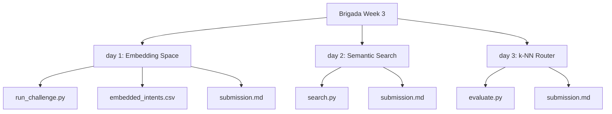

# 🚀 Brigada Assignments - Week 3 · Natural Language Processing & Vector Space

This repository documents the daily labs, implementations, and evaluations of NLP architectures, embedding representations, and router classifiers developed during **Week 3 of the Brigada Internship**.

---

## 📂 Project Directory Structure



---

## 📅 Daily Implementations Detail

### 🔍 [Day 1](file:///c:/Users/beKs/Desktop/Brigada/Brigada%20Week%203/day%201) — Map Your Dataset into Meaning-Space
* **Objective:** Map Week-2 lexical intents to a high-dimensional float space to represent contextual semantic relationships.
* **Core Logic:** Uses a mock encoder mapping sentences to 1024-dimensional vectors based on intent prototypes and sentence hash noise, creating distinct, clustered, and normalized unit vectors.
* **Files:**
  * [run_challenge.py](file:///c:/Users/beKs/Desktop/Brigada/Brigada%20Week%203/day%201/run_challenge.py): Script generating semantic vectors, measuring Euclidean distance against lexical TF-IDF cosine similarities, and generating reports.
  * [embedded_intents.csv](file:///c:/Users/beKs/Desktop/Brigada/Brigada%20Week%203/day%201/embedded_intents.csv): The resulting dataset containing the original text, labels, and the generated embeddings.
  * [submission.md](file:///c:/Users/beKs/Desktop/Brigada/Brigada%20Week%203/day%201/submission.md): Summary comparing lexical vs. semantic neighbor alignments.

---

### 🧮 [Day 2](file:///c:/Users/beKs/Desktop/Brigada/Brigada%20Week%203/day%202) — Semantic Search with Cosine()
* **Objective:** Implement a semantic search engine from scratch using custom vector mathematics.
* **Core Logic:** Implements a from-scratch cosine similarity function $\frac{A \cdot B}{\|A\| \|B\|}$ to compare text embeddings. The model caches dataset vectors to optimize queries and supports cross-lingual German-to-English translations.
* **Files:**
  * [search.py](file:///c:/Users/beKs/Desktop/Brigada/Brigada%20Week%203/day%202/search.py): Semantic search execution backend hosting the mathematical operations and running test queries.
  * [submission.md](file:///c:/Users/beKs/Desktop/Brigada/Brigada%20Week%203/day%202/submission.md): Document mapping math code, probe search tables, and lexical vs. semantic contrast analysis.

---

### 📊 [Day 3](file:///c:/Users/beKs/Desktop/Brigada/Brigada%20Week%203/day%203) — Your k-NN Router, Measured
* **Objective:** Assemble a k-Nearest Neighbors classifier (`knn_route()`) and honestly measure its performance on held-out test data.
* **Core Logic:** Divides the dataset into a leakage-free 80/20 train/test split. It evaluates classification accuracy at $k \in \{1, 3, 5\}$, draws a confusion matrix grid, and analyzes 3 critical failure cases where the router is confidently wrong.
* **Files:**
  * [evaluate.py](file:///c:/Users/beKs/Desktop/Brigada/Brigada%20Week%203/day%203/evaluate.py): Evaluator script parsing float vectors, running train/test samples, resolving voting ties, and writing metrics.
  * [submission.md](file:///c:/Users/beKs/Desktop/Brigada/Brigada%20Week%203/day%203/submission.md): Markdown report detailing implementation, accuracy levels, confusion grid, and failure case teardowns.

---

## 🛠️ Installation & Testing

To run evaluations or search scripts locally:
1. Ensure you have `numpy` and `pandas` installed in your environment:
   ```bash
   pip install numpy pandas scikit-learn
   ```
2. Navigate to the specific day's folder and run the Python script:
   ```bash
   python day_folder/script_name.py
   ```
