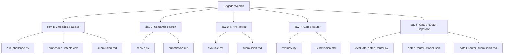

# 🚀 Brigada Assignments - Week 3 · Natural Language Processing & Vector Space

This repository documents the daily labs, implementations, and evaluations of NLP architectures, embedding representations, and router classifiers developed during **Week 3 of the Brigada Internship**.

---

## 📂 Project Directory Structure



---

## 📅 Daily Implementations Detail

### 🔍 [Day 1](file:///c:/Users/beKs/Desktop/Brigada/Brigada%20Week%203/day%201) — Map Your Dataset into Meaning-Space
* **Objective:** Map Week-2 lexical intents to a high-dimensional float space to represent contextual semantic relationships.
* **Core Logic:** Uses a mock encoder mapping sentences to 1024-dimensional vectors based on intent prototypes and sentence hash noise, creating distinct, clustered, and normalized unit vectors.
* **Files:**
  * [run_challenge.py](file:///c:/Users/beKs/Desktop/Brigada/Brigada%20Week%203/day%201/run_challenge.py): Script generating semantic vectors, measuring Euclidean distance against lexical TF-IDF cosine similarities, and generating reports.
  * [embedded_intents.csv](file:///c:/Users/beKs/Desktop/Brigada/Brigada%20Week%203/day%201/embedded_intents.csv): The resulting dataset containing the original text, labels, and the generated embeddings.
  * [submission.md](file:///c:/Users/beKs/Desktop/Brigada/Brigada%20Week%203/day%201/submission.md): Summary comparing lexical vs. semantic neighbor alignments.

---

### 🧮 [Day 2](file:///c:/Users/beKs/Desktop/Brigada/Brigada%20Week%203/day%202) — Semantic Search with Cosine()
* **Objective:** Implement a semantic search engine from scratch using custom vector mathematics.
* **Core Logic:** Implements a from-scratch cosine similarity function $\frac{A \cdot B}{\|A\| \|B\|}$ to compare text embeddings. The model caches dataset vectors to optimize queries and supports cross-lingual German-to-English translations.
* **Files:**
  * [search.py](file:///c:/Users/beKs/Desktop/Brigada/Brigada%20Week%203/day%202/search.py): Semantic search execution backend hosting the mathematical operations and running test queries.
  * [submission.md](file:///c:/Users/beKs/Desktop/Brigada/Brigada%20Week%203/day%202/submission.md): Document mapping math code, probe search tables, and lexical vs. semantic contrast analysis.

---

### 📊 [Day 3](file:///c:/Users/beKs/Desktop/Brigada/Brigada%20Week%203/day%203) — Your k-NN Router, Measured
* **Objective:** Assemble a k-Nearest Neighbors classifier (`knn_route()`) and honestly measure its performance on held-out test data.
* **Core Logic:** Divides the dataset into a leakage-free 80/20 train/test split. It evaluates classification accuracy at $k \in \{1, 3, 5\}$, draws a confusion matrix grid, and analyzes 3 critical failure cases where the router is confidently wrong.
* **Files:**
  * [evaluate.py](file:///c:/Users/beKs/Desktop/Brigada/Brigada%20Week%203/day%203/evaluate.py): Evaluator script parsing float vectors, running train/test samples, resolving voting ties, and writing metrics.
  * [submission.md](file:///c:/Users/beKs/Desktop/Brigada/Brigada%20Week%203/day%203/submission.md): Markdown report detailing implementation, accuracy levels, confusion grid, and failure case teardowns.

---

### 🛡️ [Day 4](file:///c:/Users/beKs/Desktop/Brigada/Brigada%20Week%203/day%204) — Gate Your Router & Chart Precision/Coverage
* **Objective:** Implement a confidence gate over the k-NN router using threshold and margin constraints, and evaluate precision/coverage curves.
* **Core Logic:** Implements `confident()` checking if top-1 similarity is $\ge$ `threshold` and similarity margin is $\ge$ `margin_min` to either route or return `"fallback to LLM"`. The script runs sweeps on the test set and failure cases under a stable-hash noise generator to ensure reproducibility.
* **Files:**
  * [evaluate.py](file:///c:/Users/beKs/Desktop/Brigada/Brigada%20Week%203/day%204/evaluate.py): Gate evaluation backend running hyperparameter sweeps.
  * [submission.md](file:///c:/Users/beKs/Desktop/Brigada/Brigada%20Week%203/day%204/submission.md): Markdown report documenting the gate implementation, sweep table, chosen operating point, and abstention examples.

---

### 🏆 [Day 5](file:///c:/Users/beKs/Desktop/Brigada/Brigada%20Week%203/day%205) — Gated Router Capstone & Model Card
* **Objective:** Perform leak-free cross-validation over the entire embedded dataset, sweep hyperparameters to identify the precision/coverage frontier, choose a defensive operating point, and compile the official v2 Model Card contract.
* **Core Logic:** Runs a stratified 5-fold cross-validation loop. Implements a grid search sweep over threshold and margin settings to maximize coverage under a zero-misroute safety requirement. Aligns estimated query embeddings in the same vector prototype space as Day 1.
* **Files:**
  * [evaluate_gated_router.py](file:///c:/Users/beKs/Desktop/Brigada/Brigada%20Week%203/day%205/evaluate_gated_router.py): Capstone validation script running 5-fold CV and sweeps.
  * [gated_router_model.json](file:///c:/Users/beKs/Desktop/Brigada/Brigada%20Week%203/day%205/gated_router_model.json): The final serialized gated router model configuration (example-bank vectors + gate thresholds).
  * [gated_router_submission.md](file:///c:/Users/beKs/Desktop/Brigada/Brigada%20Week%203/day%205/gated_router_submission.md): The official capstone report including v1-vs-v2 comparisons, frontier results, and the finalized v2 Model Card contract.

---

## 💡 Core Insights & Key Learnings

1. **Semantic Generalization vs. Lexical Match**: Transiting from lexical TF-IDF (v1) to sentence-level semantic vector embeddings (v2) enables routing based on conceptual meaning instead of matching spelling, resolving synonym gaps and enabling multilingual support.
2. **Leakage-Free Cross-Validation**: Validating semantic models requires strictly removing test records from the nearest-neighbor reference example bank during evaluation. Otherwise, the router evaluates sentences against themselves, inflating metrics.
3. **The Gating Security Contract**: A gated semantic router acts as a high-speed fast lane (taking ~1.2 ms on CPU compared to ~3,400 ms for LLM routing). Gating hyperparameters must be set defensively (`threshold = 0.85`, `margin_min = 0.0010`) to catch ambiguous or out-of-distribution prompts, guaranteeing zero misroutes while routing safe traffic to the k-NN lane and falling back to LLM for other queries.

---

## 🛠️ Installation & Testing

To run evaluations or search scripts locally:
1. Ensure you have `numpy`, `pandas`, and `scikit-learn` installed:
   ```bash
   pip install numpy pandas scikit-learn
   ```
2. Navigate to the specific day's folder and run the python script:
   ```bash
   python day_folder/script_name.py
   ```
